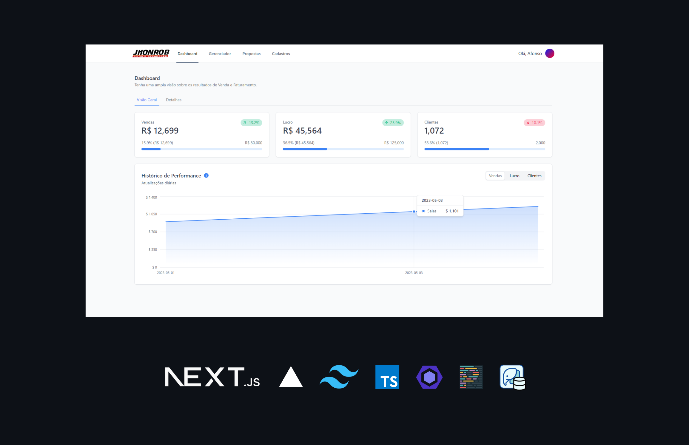

<h3 align= "center" fontSize="60px">
  JHOONROB CRM
</h3>

<p align="center">
    
</p>

## :rocket: Tecnologias
-  Next.js 14
-  Typescript
-  @tremor/react
-  @headlessui
-  Tailwind.css
-  Context API
-  Prisma ORM
-  PostgreSQL
-  Vercel Analytics

## 💻 Sobre o projeto

JHOONROB CRM é uma solução de gerenciamento de relacionamento com o cliente desenvolvida para ajudar as empresas a melhorar suas interações com os clientes, otimizar suas vendas e melhorar a lucratividade. Com uma interface de usuário intuitiva e recursos poderosos, o JHOONROB CRM oferece uma visão completa dos seus clientes, permitindo que você ofereça um serviço personalizado e melhore a satisfação do cliente.

### Funcionalidades

- [x] **Gerenciamento de Clientes**: Mantenha um registro detalhado de todos os seus clientes e interações com eles.
- [x] **Cadastro, Edição e Remoção de Produtos**: Gerencie facilmente seus produtos diretamente do CRM.
- [x] **Formulário de Steps**: Um formulário passo a passo para selecionar produtos, clientes, vendedores, definir prazos e gerar propostas comerciais.
- [x] **Gráfico de Lucro Total**: Visualize o lucro total da empresa através de um gráfico intuitivo.
- [x] **Tabela de Vendedores Destacados**: Veja quais vendedores estão se destacando, com informações sobre seus lucros e metas.
- [x] **Uso da Context API**: Utilizamos a Context API para gerenciar o estado da aplicação e armazenar informações temporariamente.

## :computer_mouse: Instalação e execução

Faça um clone desse repositório e acesse o diretório.

```bash
$ git clone git@github.com:afonsoburginski/JHONROB_CRM.git && cd JHONROB_CRM
```

```bash
# Instalando as dependências
$ yarn install

# Executanto aplicação
$ yarn run dev
```

## :speech_balloon: Autor
-  [Github](https://github.com/afonsoburginski/)
-  [Linkedin](https://www.linkedin.com/in/afonsoburginski/)
-  [Email](mailto:afonsoburginski@gmail.com/)

## 📝 Licença

Esse projeto está sob a licença MIT. Veja o arquivo [LICENSE](LICENSE.md) para mais detalhes.
